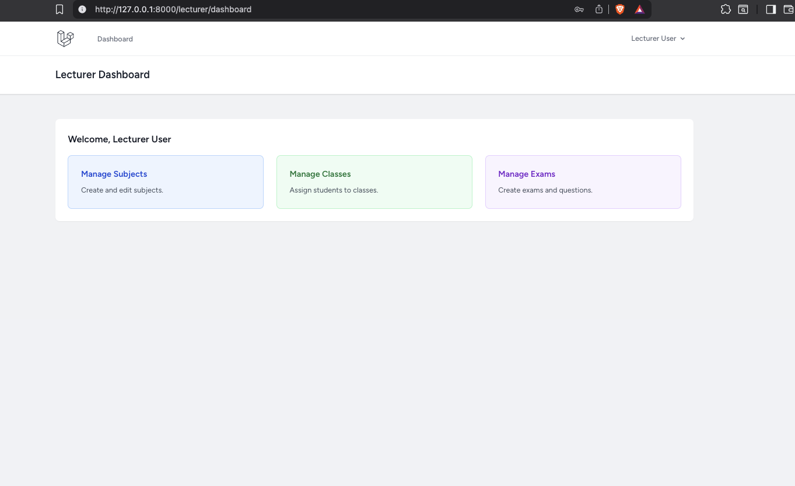
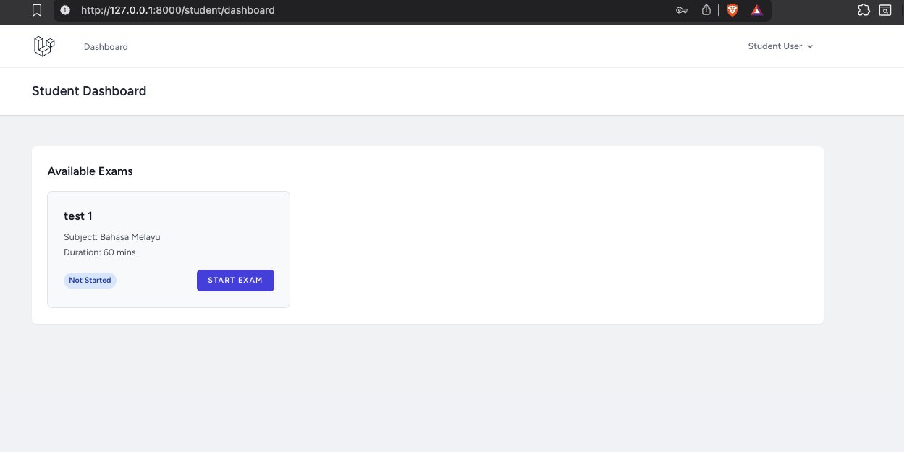
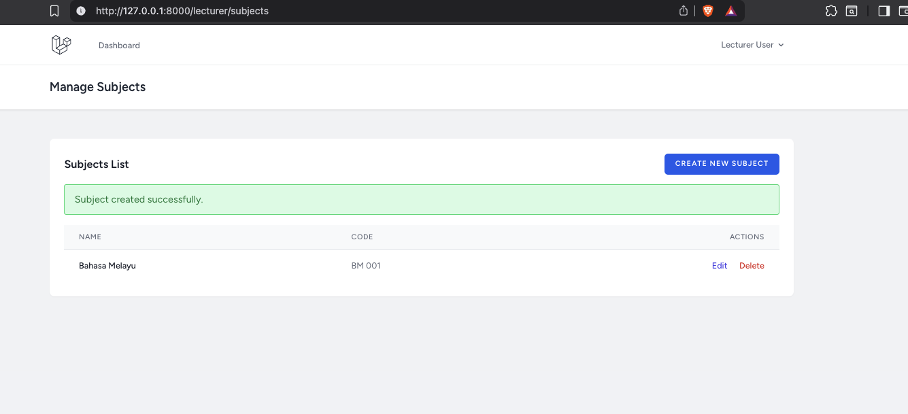
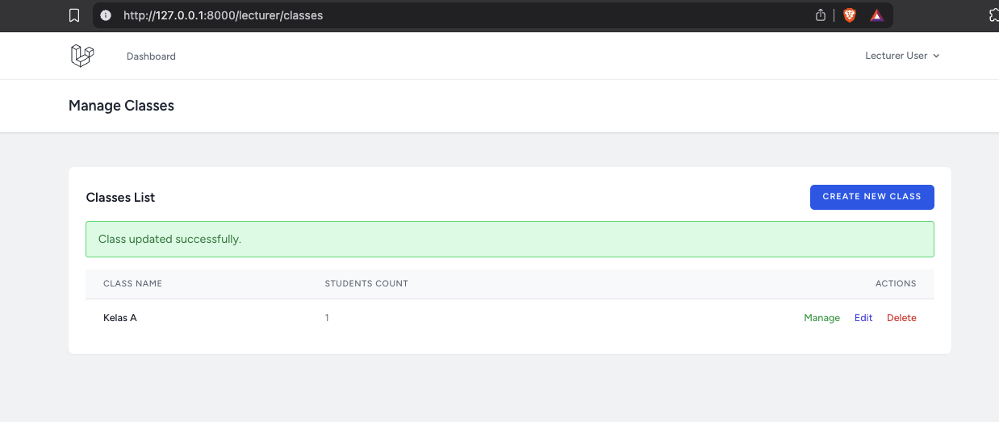
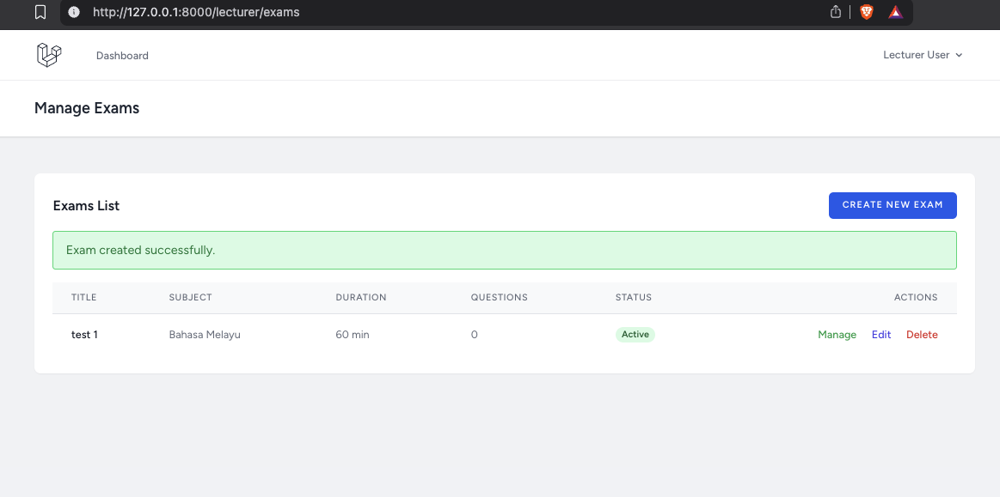

# Yayasan Peneraju Exam Online Portal

This is a comprehensive Online Examination System built with **Laravel 12** and **Tailwind CSS**. It provides a robust platform for Lecturers to conduct exams and for Students to take them in a secure, timed environment.

## 🚀 Key Features

### For Lecturers 👨‍🏫

- **Dashboard**: Quick overview of system status.
- **Subject Management**: Create and manage subjects (codes, names).
- **Class Management**:
    - Create classes.
    - Assign specific **Students** to classes.
    - Assign specific **Subjects** to classes.
- **Exam Management**:
    - Create timed exams with specific durations.
    - Assign exams to specific classes (Access Control).
    - Toggle Exam visibility (Active/Inactive).
- **Question Management**:
    - **Multiple Choice**: Auto-graded. Supports custom points.
    - **Text Answer**: Manual grading support.
- **Theme Support**: Built-in Light/Dark mode.

### For Students 👨‍🎓

- **Dashboard**: View list of exams available to your specific class.
- **Secure Exam Environment**:
    - Timer countdown (Auto-submit when time expires).
    - Validation to prevent re-taking completed exams.
- **Instant Results**: View score and review answers immediately after submission (for auto-graded sections).

## � Screenshots

### Authentication & Dashboards

|           Login Page            |                    Lecturer Dashboard                    |                    Student Dashboard                    |
| :-----------------------------: | :------------------------------------------------------: | :-----------------------------------------------------: |
|  |  |  |

### Lecturer Management

|               Manage Subjects               |              Manage Classes              |             Manage Exams              |
| :-----------------------------------------: | :--------------------------------------: | :-----------------------------------: |
|  |  |  |

### Student Exam & Results

|              Exam Result               |
| :------------------------------------: |
|  |

## 🛠️ Tech Stack

- **Framework**: Laravel 12.x
- **Frontend**: Blade Templates + Tailwind CSS + Alpine.js
- **Database**: MySQL / MariaDB
- **Authorization**: Spatie Laravel Permission

---

## ⚙️ Installation Guide

Follow these steps to set up the project locally.

### 1. Prerequisites

- PHP 8.2 or higher
- Composer
- Node.js & NPM
- MySQL/MariaDB

### 2. Setup Steps

```bash
# 1. Install PHP Dependencies
composer install

# 2. Install Frontend Dependencies
npm install

# 3. Setup Environment
cp .env.example .env

# 4. Generate App Key
php artisan key:generate
```

### 3. Database Setup

1. Create a database (e.g., `yp_exam_portal`) in your MySQL client.
2. Update `.env` file with your credentials:

```env
DB_CONNECTION=mysql
DB_HOST=127.0.0.1
DB_PORT=3306
DB_DATABASE=yp_exam_portal
DB_USERNAME=root
DB_PASSWORD=
```

3. Run Migrations & Seeders (This sets up the roles and default users):

```bash
php artisan migrate:fresh --seed
```

### 4. Build Assets

```bash
# For development (Hot Reloading)
npm run dev

# OR for production
npm run build
```

### 5. Run Server

```bash
php artisan serve
```

Visit `http://127.0.0.1:8000` in your browser.

---

## 🔑 Default Credentials

The `DatabaseSeeder` creates the following default accounts for testing:

| Role         | Email                  | Password   |
| ------------ | ---------------------- | ---------- |
| **Lecturer** | `lecturer@example.com` | `password` |
| **Student**  | `student@example.com`  | `password` |

---

## 📝 Usage Walkthrough

### Lecturer Flow

1. Login as **Lecturer**.
2. Go to **Manage Subjects** -> Create "Mathematics".
3. Go to **Manage Classes** -> Create "Class A" -> Assign yourself or students to it.
4. Go to **Manage Exams** -> Create "Mid-Term Exam".
5. Click **Manage** on the exam -> Add Questions (MCQ or Text).
6. Assign the Exam to "Class A".
7. Set status to **Active** when ready.

### Student Flow

1. Login as **Student**.
2. Dashboard shows list of assigned exams.
3. Click **Start Exam**.
4. Answer questions within the time limit.
5. Click **Submit** or wait for timer to zero out.
6. View Results.

---

## 🐳 Docker Setup

If you prefer using Docker, follow these steps to run the application in a containerized environment.

### 1. Configure Environment

Update your `.env` file to point to the Docker database service. **Note:** You might want to create a `.env.docker` file or modify `.env` temporarily.

```env
DB_CONNECTION=mysql
DB_HOST=exam-online-mysql
DB_PORT=3306
DB_DATABASE=yp_exam_portal
DB_USERNAME=root
DB_PASSWORD=your_password  # Ensure this matches docker-compose.yml (default is empty in your file if using specific vars)
```

### 2. Start Services

Run the following command to build and start the containers:

```bash
docker-compose up -d --build
```

### 3. Install Dependencies

Since the code is mounted as a volume, you need to install dependencies inside the container:

```bash
# Install PHP dependencies
docker-compose exec exam-online-system composer install

# Install Node dependencies and build assets
docker-compose exec exam-online-system npm install
docker-compose exec exam-online-system npm run build
```

### 4. Setup Database

Run the migrations and seeders inside the container:

```bash
docker-compose exec exam-online-system php artisan migrate:fresh --seed
```

### 5. Access Application

The application will be available at: **http://localhost:8001**
